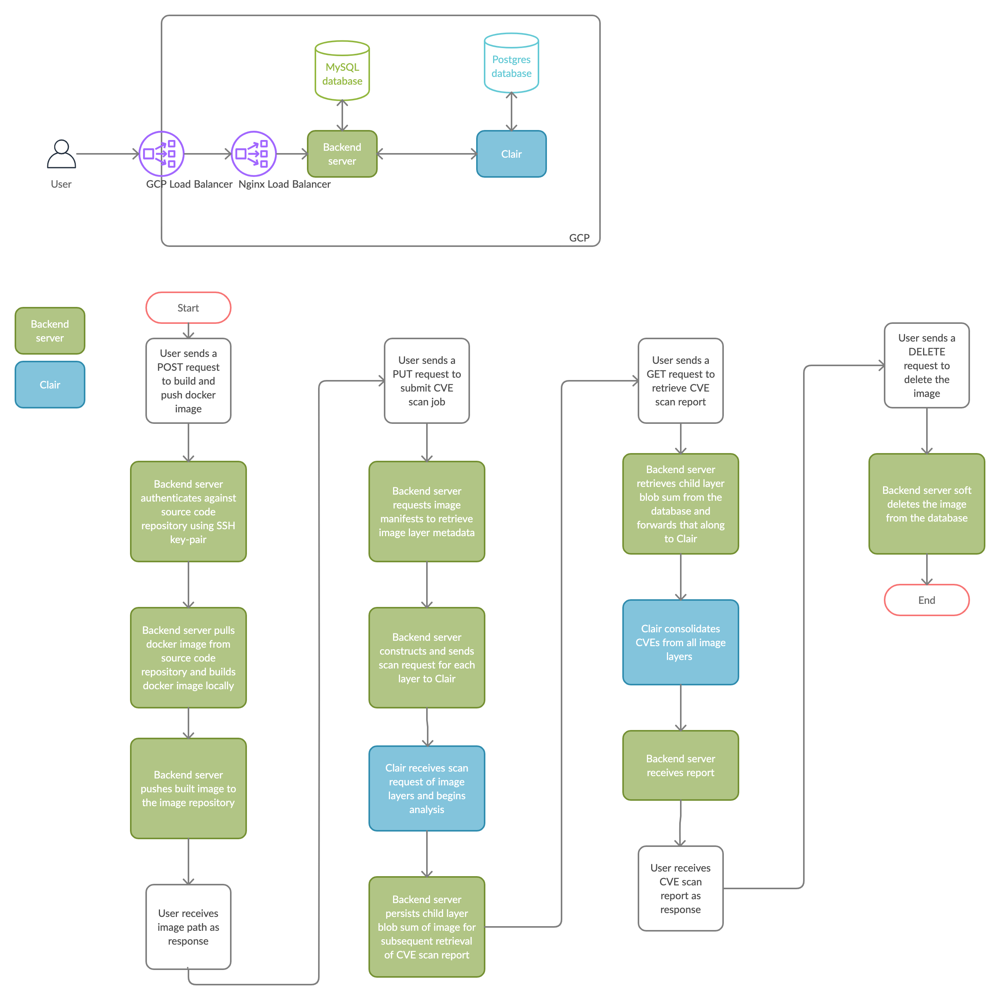
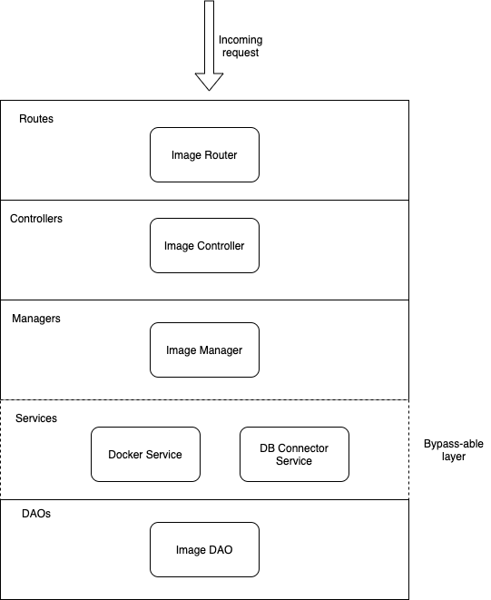

## Description
This repository contains a [Common Vulnerability Exposures/Enumeration (CVE) scanner](https://github.com/quay/clair) which can be integrated with a build pipeline.
A CVE scanner performs static analysis of a image by checking for vulnerabilities in the layers that compose the image.


## Technologies used
This application uses these open source projects to work properly:
* [Clair](https://github.com/quay/clair) - CVE scanner
* [Docker] 
* [node.js] - evented I/O for the backend


## Basic Flow

1. User sends a `POST` request to build and push an image. 
2. Application builds and pushes the image to the image repository.
3. User sends a `PUT`request to submit a CVE scan.
4. Application pulls image from the image repository, consolidates all the image metadata and submits a job to the running Clair container to perform the static analysis of vulnerabilities.
5. User sends a `GET` request to get the CVE scan report.
6. Application forwards the request to clair.
7. User sends a `DELETE` request to remove the image.
8. Application soft deletes the image from the database.

This application uses an open-layered and microservices architecture.

*Open Layered Architecture*
The roles of each of these layers are detailed below:
1. Routes
* Contains routers which route requests based on their paths to the layer below.
* E.g. The `image router` handles all requests bound for `/image` and hands off the request to the `image controller`.
2. Controllers
* Contains controllers which perform basic validation, formatting of request and response.
* E.g. The `image controller` performs basic validation of the request payload before handing off to the `image manager`.
3. Managers
* Handles bulk of the logic and interacts with both the `DAOs` and optionally, the `Services` layer. 
* E.g. The `image manager` interacts with the `docker service` in the `Services` layer to get perform tasks such as pushing the built image. It also interacts with the `image DAO` in the `DAOs` layer for getting persisted data and for persisting data.
4. Services
* Contains services which allow the application to communicate with external services. This is a bypass-able layer.
* E.g. The `docker service` handles all the logic of communicating with the `Docker` API, while the `DB connector service` handles the initial database connection.  
5. DAOs
* Contains database access objects (DAO) which handle persistence.
* E.g. The `image DAO` interacts with the `image` table in the database to handle persistence. 

*Microservices Architecture*
As shown in the first diagram, there are 2 services:
* Backend
* Clair 

Backend handles user requests to build and push images. It also communicates with the `Clair` service to submit CVE scan requests and to retrieve CVE scan reports. 

## Setting up locally
Ensure that you have the following dependencies:
* Docker
* docker-compose
* `ssh-keygen`
* `ssh-keyscan`
* Postman 
* Nginx (optional)


1. Create a SSH key-pair and save it to `~/.ssh/cs3219`. Add `github.com` to the `known_hosts` file under `~/.ssh/cs3219/known_hosts`. 
This SSH key-pair will be mounted into the application container and be used to authenticate against the source control repository for retrieving the Dockerfile.
- Ensure directory to save SSH keys exists: `mkdir -p ~/.ssh/cs3219`
- Generate SSH key-pair: `ssh-keygen`
- Update the `known_hosts` file: `ssh-keyscan github.com >> ~/.ssh/cs3219/known_hosts`

2. Fork this repository and add your SSH public key to the repository.


3. (Optional) Startup Nginx.
```
nginx -c $PWD/deployments/roles/nginx/templates/local/nginx.conf
``` 

4. Startup the application.
```
docker-compose up
``` 

5. Import the postman collection to issue requests against the running application.

6. Verify that the request is proxied by Nginx.
```
tail -f /usr/local/var/log/nginx/access.log
```

7. Terminate the application and perform cleanup.
```
docker-compose down
```
 
 
## Sending Requests
### Accessing the application locally
Import the Postman collection and use [`local.postman_environment.json`](./documentation/postman/env/local.postman_environment.json).

### Accessing deployed application
Import the Postman collection and use [`deployed.postman_environment.json`](./documentation/postman/env/local.postman_environment.json).

> Requests in the Postman collection are labelled and should be sent **sequentially** in that order.
##### 1. Build and Push Image
* Builds docker image using the passed source code repository as the context, before pushing the image to the passed image repository. 
* *This endpoint requires authentication for accessing both the source code repository (using SSH keys configured earlier) and the image repository (by basic authentication in the request headers)*

**Expected request:**
```bash
curl --location --request POST 'localhost/image' \
--header 'Authorization: Basic {{image-repo-username}}:{{image-repo-password}}' \
--header 'Content-Type: application/json' \
--data-raw '{"sourceCodeRepoUri": "git@github.com:leongshengmin/cve-scanner.git",
"imageRepoUri": "cs3219sm"}'
```
**Expected response:**
`200 OK`
```
{
    "status": 201,
    "data": {
        "imagePath": "cs3219sm/cve-scanner.git:dbc328ed3569210e"
    }
}
```

###### Before continuing:
Verify that the image has been pushed to the image repository. 
Either the [already preconfigured image repository](https://hub.docker.com/r/cs3219sm/cve-scanner.git/tags) or the image repository that you created.


##### 2. Request for a CVE scan
> Ensure that the image has been uploaded to the image repository before sending this request.
* Submits a scan request to the running Clair container.
* Use the image tag returned from the POST request in the payload.
* *This endpoint requires authentication for accessing the image repository (by basic authentication in the request headers)*

**Expected request:**
```bash
curl --location --request PUT 'localhost/image' \
--header 'Authorization: Basic {{image-repo-username}}:{{image-repo-password}}' \
--header 'Content-Type: application/json' \
--data-raw '{
"imageRepoUri": "cs3219sm",
"imageName": "cve-scanner.git",
"imageTag": "dbc328ed3569210e"
}'
```

**Expected response:**
`200 OK`

##### 3. Retrieve the CVE scan report.
* Retrieves the CVE scan report from Clair for the passed image.

**Expected request:**
```bash
curl --location --request GET 'localhost/image' \
--header 'Content-Type: application/json' \
--data-raw '{
"imageName": "cs3219sm/cve-scanner.git:dbc328ed3569210e"
}'
```

**Expected response:**
`200 OK`
```
{
    "status": 200,
    "data": {
        "Layer": {
            "Name": "sha256:cbdbe7a5bc2a134ca8ec91be58565ec07d037386d1f1d8385412d224deafca08",
            "NamespaceName": "alpine:v3.11",
            "ParentName": "sha256:5228d41d469dc1c755acb79eb4c39fdc84992b1fc37ec32061858a7cec857d30",
            "IndexedByVersion": 3,
            "Features": [
                {
                    "Name": "libssl1.1",
                    "NamespaceName": "alpine:v3.11",
                    "VersionFormat": "dpkg",
                    "Version": "1.1.1g-r0",
                    "AddedBy": "sha256:cbdbe7a5bc2a134ca8ec91be58565ec07d037386d1f1d8385412d224deafca08"
                },
                {
                    "Name": "musl-utils",
                    "NamespaceName": "alpine:v3.11",
                    "VersionFormat": "dpkg",
                    "Version": "1.1.24-r2",
                    "AddedBy": "sha256:cbdbe7a5bc2a134ca8ec91be58565ec07d037386d1f1d8385412d224deafca08"
                },
                ...
            ]
        }
    }
}
```

##### 4. Delete the image
* Soft deletes the image from the database.

Expected request:
```bash
curl --location --request DELETE 'localhost/image' \
--header 'Content-Type: application/json' \
--data-raw '{
"imageName": "shengmin98/test-repo-with-dockerfile:7afd06e76ac177f7"
}'
```

Expected response:
`202 accepted`

## Running tests locally
To run all tests, run this in the terminal
```bash
npm run test-dev
```

## Running tests using the CI tool 
1. Create a PR to master on github.
2. This should trigger a build on CircleCI. In this build, the tests should be run automatically.